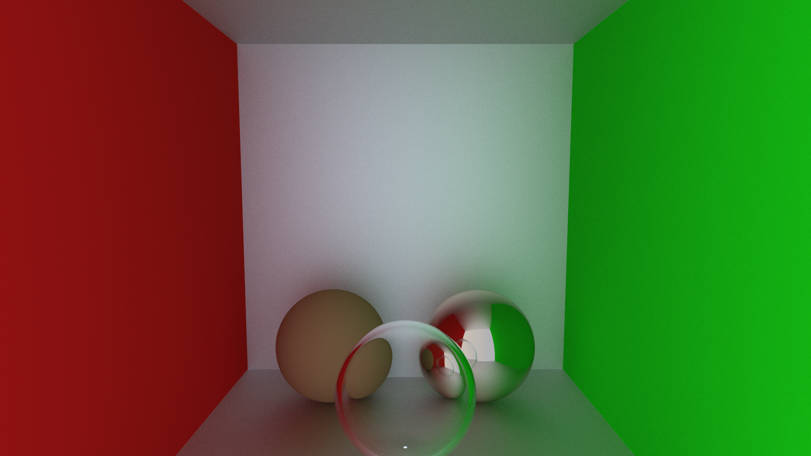
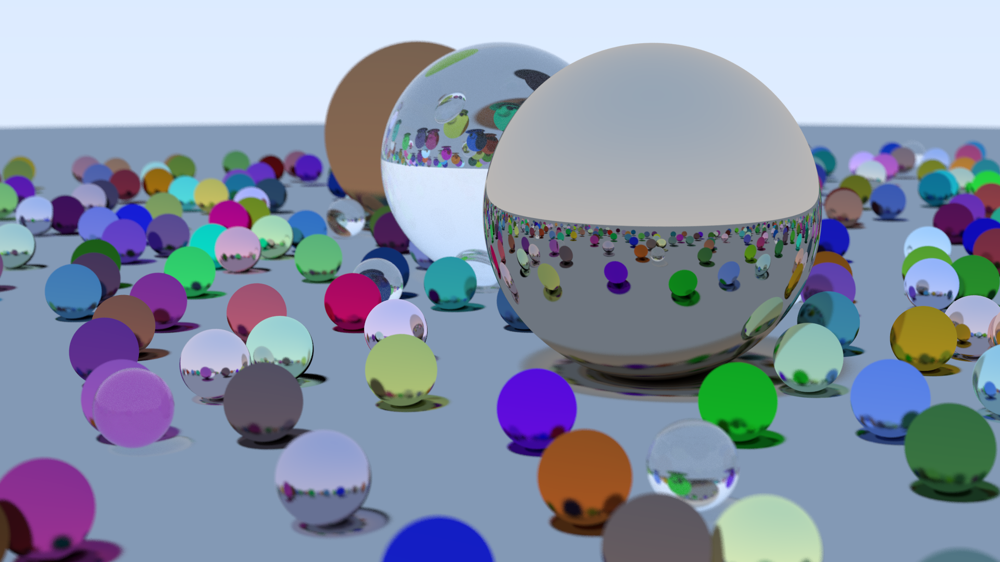

# Ray Tracer

Minimum implementation of a ray tracing renderer.

# Sample Images



# Build & Run
```bash
cmake -B build
./build/bin/RayTracingRenderer
```

# Credit
Started from [_Ray Tracing in One Weekend_](https://raytracing.github.io/books/RayTracingInOneWeekend.html)